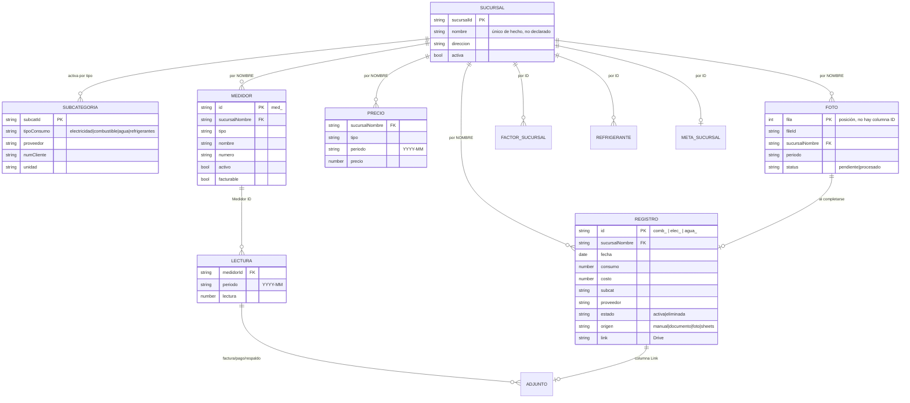

# Modelo de datos — Registro de Consumos

Qué persiste la app, dónde, con qué clave y quién lo escribe. Complementa a
`ARQUITECTURA.md`, que explica el *cómo* (transporte, migración al SDK, caché);
acá está el *qué*.

El destino de este modelo es una base relacional: `ESQUEMA-POSTGRES.sql` es su
traducción a PostgreSQL —con las deudas de abajo resueltas— y
`app/api/migracion/postgres/route.js` emite el volcado de la planilla a ese
esquema. Ver "Hacia PostgreSQL", al final.

La fuente de verdad de este documento es el código, no la planilla: los
encabezados los declara `lib/google/headers.js` y las posiciones de columna
`lib/sheets/*.js`. Si una hoja real difiere, gana el código — y la lectura corta
con un mensaje (`lib/sheets/encabezados.js`).

## Dónde viven los datos

No hay base de datos. Hay tres almacenes:

| Almacén | Qué guarda | Acceso |
|---------|-----------|--------|
| **Una planilla de Google Sheets** | todas las entidades, una hoja por entidad | service account (SDK) → `lib/google/` |
| **Carpetas de Google Drive** | los archivos adjuntos (PDF de boletas, fotos, comprobantes) | service account, dentro de una **Unidad compartida** |
| **La hoja `Config`** (key/value con JSON) | configuración de la instancia, incluido el mapa de carpetas de Drive | `lib/sheets/config-store.js` |

Consecuencias del sustrato, porque explican casi todas las decisiones de abajo:

- **Una hoja no tiene clave primaria, ni tipos, ni integridad referencial.** Todo
  eso lo sostiene la app por convención, y ninguna violación produce un error.
- **Las personas editan las mismas hojas que la app.** Ordenar filas, renombrar
  una columna o borrar una fila son operaciones que ocurren y que el modelo tiene
  que tolerar.
- **Todo valor llega como texto con formato local** (`"$ 1.234,56"`,
  `"31-07-26"`). El casteo vive en `lib/domain/parse.js`.
- **La cuota de la API de Sheets es de 60 lecturas por minuto**, así que las
  lecturas están cacheadas por etiqueta y no se lee "en cada render".

## Diagrama



Las relaciones del diagrama son **convenciones de la app**, no restricciones de
la planilla: nada impide una lectura huérfana o una sucursal referida por un
nombre que ya no existe.

## Hojas

Once hojas. Nueve las escribe la app; dos son de un flujo externo y solo
aparecen porque su encabezado está declarado.

| Hoja | Entidad | Filas por | Clave | Escribe |
|------|---------|-----------|-------|---------|
| `Combustible` | Registro de consumo | consumo | `ID` (col 11) | `append`, `updateCeldasPorClave` |
| `Electricidad` | Registro de consumo | consumo | `ID` (col 12) | idem |
| `Agua` | Registro de consumo | consumo | `ID` (col 13) | idem |
| `Config Sucursales` | Sucursal + subcategorías | subcategoría | `Sucursal ID` (grupo) | `upsertSucursal` |
| `Medidores` | Medidor | medidor | `ID` | `upsertMedidores` |
| `Lecturas Medidor` | Lectura + adjuntos | (medidor, mes) | `Medidor ID` + `Período` | `upsertLecturasMedidor` |
| `Precios Medidor` | Tarifa | (sucursal, tipo, mes) | las tres columnas | `upsertPreciosMedidor` |
| `Emisiones` | Factores, refrigerantes y metas | ver abajo | `Scope` + `Sucursal ID` + `Key` | `upsertEmisiones` |
| `Fotos` | Foto pendiente | foto | **la posición de la fila** | `append`, `updateCells` |
| `Config` | key/value | clave | `key` | `setConfig` |
| `N° de cliente`, `Fill out` | flujo externo | — | — | **nadie**: la app no las lee ni las escribe |

### Registros de consumo — `Combustible` / `Electricidad` / `Agua`

Tres hojas con esquemas parecidos pero distintos, que la app aplana en **una
sola** lista de Registros (`readRecords`). El mapa de columnas está en un solo
lugar: `LAYOUT` en `lib/sheets/records.js`.

| # | Combustible | Electricidad | Agua |
|---|-------------|--------------|------|
| 1 | Link | Link PDF | Link PDF |
| 2 | Fecha | Número de cliente | Número de cliente |
| 3 | Consumo | Fecha | Fecha emisión |
| 4 | Costo | Consumo total | Consumo total |
| 5 | Empresa | Costo ($) | Costo ($) |
| 6 | Sucursal | Empresa | Empresa |
| 7 | Tipo | Sucursal | Sucursal |
| 8 | Proveedor | Tipo de consumo | Tipo de consumo |
| 9 | Estado | Proveedor | Proveedor |
| 10 | Origen | Estado | Subcategoría |
| 11 | **ID** | Origen | Estado |
| 12 | | **ID** | Origen |
| 13 | | | **ID** |

Notas del esquema, todas con consecuencias:

- **`Empresa`** lleva siempre la constante `EMPRESA` de `lib/instance.js`
  (`"NEXT"` en esta instancia). Es un discriminante de instancia, no un dato.
- **`Sucursal` es el NOMBRE**, no el `Sucursal ID`. Ver "Deudas del modelo".
- **`Tipo` / `Tipo de consumo` / `Subcategoría` guardan etiquetas, no ids.**
  Combustible escribe `"Petróleo Diésel"`; Electricidad y Agua escriben una
  etiqueta fija con emoji (`"⚡Energía kWh"`, `"💧Agua m3"`). Al leer se vuelve
  al id con heurísticas de texto (`combSubcatFromLabel`, `aguaSubcatFromLabel`).
  Las etiquetas las leen personas y filtros del Sheet: cambiarlas exige migrar
  las filas existentes.
- **`Estado`** es `Activa` | `Eliminada`. El borrado es lógico: ninguna fila se
  elimina de la planilla.
- **`Origen`** es `Manual` | `Documento` | `Foto` | vacío. El vacío significa
  "fila preexistente" y se lee como `sheets`.
- **La `Unidad` no se guarda**: se deriva del tipo y la subcategoría (`kWh`,
  `m³`, `L`, `kg`).
- **La `Fecha` se escribe distinto según el origen**: los manuales guardan el día
  que eligió el usuario en `DD-MM-YY`; los extraídos de un documento, el cierre
  del período (`DD/MM/YYYY` en combustible).

### `Config Sucursales`

Aplanado de un árbol: una fila por **subcategoría activa**, con las cuatro
columnas de la sucursal repetidas en cada fila. Una sucursal sin subcategorías
activas deja una fila base con el resto vacío, para no desaparecer.

```
0 Sucursal ID | 1 Nombre | 2 Dirección | 3 Activa | 4 Tipo consumo
5 Subcat ID   | 6 Sistema eléctrico | 7 Tipo | 8 Tipo (otro) | 9 Uso
10 Unidad     | 11 Proveedor | 12 Proveedor (otro) | 13 N° cliente
```

`flatten` / `unflatten` en `lib/sheets/sucursales.js`. Los cuatro tipos de
consumo posibles son `electricidad`, `combustible`, `agua`, `refrigerantes` — el
cuarto **solo** existe acá y en `Emisiones`, no tiene hoja de registros.

`Activa` se lee permisivo: solo un `"No"` explícito desactiva; vacío es activa.

### Módulo Medidores — tres hojas

```
Medidores:         ID | Sucursal | Tipo | Nombre | Número | Activo | Facturable
Lecturas Medidor:  ID | Medidor ID | Período | Lectura
                   | Factura Link | Factura Nombre | Factura File ID
                   | Pago Link    | Pago Nombre    | Pago File ID
                   | Respaldo Link| Respaldo Nombre| Respaldo File ID
Precios Medidor:   Sucursal | Tipo | Período | Precio
```

- **Los adjuntos no son una entidad**: los tres documentos de una lectura viajan
  en su propia fila, tres columnas cada uno. Una lectura tiene a lo más una
  factura, un pago y un respaldo.
- **`Lecturas Medidor` tiene columna `ID` pero la clave real es
  `(Medidor ID, Período)`.** El id se acuña al insertar y solo se usa si la fila
  es nueva; si ya existe, gana el de la planilla. La razón está en
  `lib/sheets/medidores.js`: la UI genera un id nuevo en cada tecla, así que ese
  id no identifica nada.
- **Una fila de lectura puede tener solo adjuntos y ninguna lectura.** Al leer se
  parte en dos estructuras: `readings` (las que tienen número) y `docs`
  (indexado por `` `${meterId}__${month}` ``).
- **El precio es por `(sucursal, tipo, mes)`, no por medidor** — decisión de
  producto: la tarifa es compartida entre los medidores de una sucursal.
- **`Facturable`** distingue el medidor que entra en el total contra la boleta de
  los de control interno. Vacío se lee como facturable (columna agregada
  después).

### `Emisiones`

Una hoja de 7 columnas que guarda **cinco cosas distintas**, discriminadas por
la columna `Scope`:

| Scope | Sucursal ID | Key | Value | Pending Review | Refrig Tipo | Refrig Mes |
|-------|-------------|-----|-------|----------------|-------------|------------|
| `factor-empresa` | — | id del factor | kgCO₂e/unidad | — | — | — |
| `factor-sucursal` | sí | id del factor | kgCO₂e/unidad | `Sí`/`No` | — | — |
| `refrigerante` | sí | `uid` de la carga | carga en kg | — | id del gas | `YYYY-MM` |
| `meta-empresa` | — | campo de meta | valor | — | — | — |
| `meta-sucursal` | sí | campo de meta | valor | — | — | — |

- **De los factores se persiste solo el número.** Etiqueta, unidad, alcance y
  fuente vienen del catálogo en código (`EMISSION_FACTOR_CATALOG`), así que
  corregir un texto no obliga a migrar la planilla.
- **Los factores de sucursal son overrides**: lo que no está, se hereda de
  empresa.
- **`Pending Review`** marca un valor personalizado que hay que revisar; solo
  aplica a `factor-sucursal`.
- **Campos de meta** (`META_FIELDS`, en `lib/domain/emisiones-patch.js`):
  `absoluta`, `relativa`, `anioBase`, `baseEmissions`, `baseMode`.
- **Los refrigerantes se escriben por grupo**, no fila por fila: la clave de
  grupo es `(refrigerante, Sucursal ID)` y se reemplaza el conjunto de esa
  sucursal. Es la única entidad cuyo conjunto se reemplaza, porque el `uid` de
  una carga no es estable entre guardados.

### `Fotos`

```
1 File ID | 2 Drive URL | 3 Fecha subida | 4 Tipo | 5 Sucursal | 6 Subcategoría
7 Período | 8 Status | 9 Fecha completado | 10 Consumo | 11 Unidad | 12 Costo
13 Proveedor | 14 Notas
```

Cola de trabajo, no registro definitivo: `Status` va de `pendiente` a
`procesado`. Al completarse pasan tres cosas en `completeFoto`
(`lib/sheets/fotos.js`): se marcan las celdas de la fila, se **escribe un
Registro de consumo** con el mismo writer que el resto de la app, y el archivo se
mueve de la carpeta "por completar" a "procesados".

Esto significa que **el consumo de una foto queda en dos hojas**: los datos
operativos en `Fotos` y el consumo en su hoja de tipo. `Fotos` no guarda el `ID`
del Registro que produjo, así que la relación no es navegable en ninguna
dirección.

### `Config` — key/value

Dos columnas, `key` y `value`, con el valor serializado como JSON (admite objetos
y arreglos). Claves en uso:

| Clave | Forma | Para qué |
|-------|-------|----------|
| `driveFolders` | objeto de ~25 ids | mapa de carpetas de Drive de la instancia |
| `fotoNotifEmails` | arreglo de strings | destinatarios del aviso "hay fotos por completar" |
| `registrosConId` | `true` | bandera: las hojas de consumo ya tienen su columna `ID` |

Los ids de carpetas viven acá y no en el entorno a propósito: son muchos y crecen
con cada proveedor, así que agregar uno no obliga a redeployar. Igual la bandera
`registrosConId`: quien tiene o no la columna es la planilla, no el deploy.

Forma de `driveFolders` (`lib/drive-folders.js`):

```js
{
  fotosPorCompletar, fotosProcesados,   // flujo "Tomar foto"
  manualFacturas,                        // adjunto del registro manual
  uploadFacturas,                        // fallback de "Subir documento"
  medidorFacturas, medidorPagos,
  medidorRespaldos: { [tipoConsumo]: id },
  proveedores:      { [providerId]: { porProcesar, procesados } },
}
```

## Identidad y claves

Cuatro esquemas de identidad conviviendo, cada uno con su razón:

| Esquema | Dónde | Forma |
|---------|-------|-------|
| Id acuñado, columna `ID` | Registros, Medidores | `comb_lz3k_7a1b`, `med_lz3k_7` |
| Clave natural compuesta | Lecturas, Precios, Emisiones | `(Medidor ID, Período)`, etc. |
| Id de grupo | Config Sucursales, refrigerantes | `Sucursal ID` |
| **Posición de la fila** | Fotos, y los Registros sin migrar | la fila 14 |

Los ids llevan timestamp en base36 más un contador y azar
(`lib/domain/ids.js`). El prefijo de un id de Registro (`comb_`, `elec_`,
`agua_`) es lo único que dice en qué hoja vive la fila, porque el id viaja solo
hasta `updateRecordField`.

**La identidad posicional es la deuda técnica central del modelo.** Era el único
esquema del prototipo: `comb-12` *era* la fila 14. El problema no es que falle,
es que acierta casi siempre — hasta que alguien ordena la planilla o borra una
fila de arriba, y entonces la edición se escribe en el registro de al lado sin
producir ningún error. Estado hoy:

- **Registros:** resuelto. La columna `ID` está al final de las tres hojas y
  `updateCeldasPorClave` es el `UPDATE ... WHERE` que la API de valores no tiene.
  Los ids posicionales (guion medio: `comb-12`) y los reales (guion bajo:
  `comb_...`) conviven mientras queden filas sin pasar por
  `/api/migracion/columna-id`.
- **Fotos:** sin resolver. No tiene columna `ID` y `completeFoto` escribe por
  `rowIndex`. Es el mismo riesgo, en una hoja con menos filas y menos edición
  manual.

## Formatos

| Dato | En la planilla | En el dominio |
|------|----------------|---------------|
| Fecha de registro | `DD-MM-YY` (manual), `DD/MM/YYYY` (documento) | ISO `YYYY-MM-DD` |
| Período / mes | `YYYY-MM` | igual |
| Número | texto local: `"$ 1.234,56"`, `"15771,848"` | `Number` |
| Booleano | `Sí` / `No`, y vacío = el default permisivo | `boolean` |
| Timestamps de Fotos | ISO completo | string |

`parseDate` tolera seis formatos, incluido el serial de fecha de Sheets, porque
todos aparecen en las hojas reales. `toNumber` deshace el formato chileno (punto
de miles, coma decimal) y devuelve `0` ante lo que no pueda leer — un vacío y un
`"n/d"` son indistinguibles después de pasar por ahí.

## Catálogos: qué NO se persiste

Vive en código, no en la planilla (`lib/domain/catalog.js`,
`lib/domain/emisiones.js`):

- **Tipos de consumo**: `electricidad` (kWh), `combustible` (L/kg/m³), `agua`
  (m³), y `refrigerantes` solo como tipo de configuración.
- **Subcategorías de combustible** con su unidad por defecto y las admitidas
  (11 entradas: diésel, kerosene, GLP, leña, pellets…).
- **Proveedores** por tipo (~35 nombres).
- **Factores de emisión** base con su alcance, unidad y fuente (IPCC 2006 /
  Huella Chile).
- **Refrigerantes** con su GWP a 100 años (AR5).

Las subcategorías que crea el usuario no entran a un catálogo: se guardan como
`otro:<slug>` y la etiqueta se reconstruye desde el slug.

## Reglas de escritura

Dos invariantes que sostienen el modelo, y que se pueden revisar en un diff:

1. **Ningún camino de la app reescribe una hoja completa.** Toda escritura es un
   upsert por clave o una celda puntual. `reemplazarHoja` existe pero no tiene
   llamadores en la app. Antes no era así, y ese era el modo de falla real:
   la planilla quedaba igual a la copia del último que guardó, así que dos
   dispositivos editando a la vez se borraban el trabajo.
2. **Se escribe antes de borrar.** Sin `LockService` —el SDK no lo tiene—, el
   orden inverso deja una ventana con la hoja vacía.

En Medidores y Emisiones lo que viaja al servidor es un **patch** (qué filas
cambiaron, qué filas se quitaron), calculado en el cliente contra su último
estado confirmado. No es una preferencia de arquitectura: si el cliente mandara
la tabla entera, "esta fila no viene" sería ambiguo entre "la borré" y "nunca la
vi" (`lib/domain/medidores-patch.js`).

Cada lectura está cacheada con una etiqueta y cada mutación invalida solo lo que
tocó: `rc:records`, `rc:sucursales`, `rc:emissions`, `rc:medidores`, `rc:fotos`,
`rc:config` (`TAGS` en `lib/apps-script.js`).

## Deudas del modelo

Cosas que el modelo no resuelve hoy. Ninguna es una hipótesis: todas se pueden
leer en el código citado.

**1. La sucursal se referencia de dos formas distintas.**

| Referencia por `Sucursal ID` | Referencia por **nombre** |
|------------------------------|---------------------------|
| `Emisiones` (factores, refrigerantes, metas) | `Combustible` / `Electricidad` / `Agua` |
| | `Medidores`, `Precios Medidor` |
| | `Fotos` |

El nombre es una clave mutable, así que renombrar una sucursal es una migración
de datos. `renameSucursalInRecords` (`lib/sheets/records.js`) la hace **solo en
las tres hojas de consumo**: `Medidores`, `Precios Medidor` y `Fotos` quedan
apuntando al nombre viejo, y sus filas se vuelven invisibles para la UI, que
cruza por `s.nombre === sucursal` (`lib/reportes/medidores-html.js:78`). El
onboarding y la configuración conocen el `Sucursal ID`; las hojas de datos, no.

**2. `Fotos` escribe por posición de fila** — mismo riesgo que ya se corrigió en
los Registros, sin corregir acá.

**3. Un consumo de foto queda en dos hojas sin enlace entre ellas.** `Fotos` no
guarda el `ID` del Registro que produjo, así que no se puede ir de una a la otra
ni detectar un duplicado si `completeFoto` se corre dos veces.

**4. Las subcategorías se guardan como etiqueta legible, y se recuperan con
heurísticas de texto.** `combSubcatFromLabel` clasifica por `includes`: una
etiqueta nueva que contenga "gas" se lee como GLP. Es tolerante a propósito
—esas columnas las escriben personas— pero no es reversible.

**5. La unidad de un registro es derivada, no guardada.** Un combustible en
galones se guardaría como si fuera litros: `combUnit()` mira solo la
subcategoría, aunque `FUEL_SUBCATS_CATALOG` declare `units: ["L", "gal"]`.

**6. `toNumber` colapsa el error en `0`.** Un consumo ilegible y un consumo cero
son el mismo dato después de leer.

**7. No hay usuarios.** El acceso es una sola contraseña compartida con cookie
firmada (`lib/auth/acceso.js`); ninguna fila registra quién la escribió. El campo
`Nombre Usuario` que existe es de la hoja `Fill out`, del flujo externo.

## Hacia PostgreSQL

Tres archivos, escritos a partir de este documento y del código que cita:

| Archivo | Qué es |
|---------|--------|
| `ESQUEMA-POSTGRES.sql` | El esquema relacional: PKs, FKs, catálogos, CHECKs e índices |
| `ESQUEMA-POSTGRES-RLS.sql` | El aislamiento entre clientes. Se aplica DESPUÉS de cargar los datos |
| `app/api/migracion/postgres/route.js` | Volcado de la planilla a ese esquema. No escribe: emite SQL |

```sh
npm run db:check                                   # arma el esquema en PGlite y prueba el alcance
curl -s 'localhost:3000/api/migracion/postgres?informe=si' | jq   # qué NO se migra y por qué
curl -s localhost:3000/api/migracion/postgres > carga.sql
npm run db:check carga.sql                         # esquema + datos + RLS, todo junto
```

`npm run db:check` corre el esquema en un Postgres de verdad —PGlite, que es
Postgres compilado a WebAssembly— sin necesidad de `psql` ni de docker. No es un
extra: hasta que existió, el esquema estaba escrito pero **nunca se había
ejecutado**, y el primer intento falló en la primera línea. Además de compilar el
DDL, comprueba el alcance entre clientes con datos de prueba, que es lo único que
distingue "las políticas se crearon" de "las políticas aíslan".

Contra el Postgres real de Supabase, en un esquema desechable que se borra al
terminar (la base queda como estaba):

```sh
npm run db:supabase                  # arma, prueba y borra
npm run db:supabase carga.sql        # además carga el volcado
npm run db:supabase -- --conservar   # no borra, para poder mirar
```

Y para instalarlo de verdad en `public`, que no se borra:

```sh
npm run db:instalar                  # solo las tablas
npm run db:instalar carga.sql        # tablas + datos
```

`db:instalar` se niega a correr si `public` ya tiene alguna de estas tablas, y
mete todo en una sola transacción: si algo falla a mitad de camino, la base no
cambia. Necesita `DATABASE_URL` en `.env.local`, con la cadena del **pooler en
modo Session** (puerto 5432): la conexión directa de Supabase
(`db.<ref>.supabase.co`) solo existe en IPv6.

O con `psql`, si algún día está instalado:

```sh
psql "$DATABASE_URL" -f ESQUEMA-POSTGRES.sql
psql "$DATABASE_URL" -1 -f carga.sql
psql "$DATABASE_URL" -f ESQUEMA-POSTGRES-RLS.sql    # al final: con RLS activo, la carga no vería nada
```

### La jerarquía y el alcance

El destino es un **módulo del SaaS RECYLINK**: los usuarios entran por la
plataforma y cada cliente ve solo su versión de la herramienta. Eso cambia algo
de fondo respecto de hoy, y no es solo una columna más:

- Hoy `EMPRESA` es una **constante del deploy** (`lib/instance.js`, `"NEXT"`) y
  cada cliente tiene su instancia y su planilla. En RECYLINK es una **fila**, y
  las de todos los clientes conviven en la misma base.
- La jerarquía es **holding → empresa → sucursal**, la misma que ya tiene
  RECYLINK, y un usuario está en **un** nivel. Las tres tablas son proyección
  local de las suyas: cada una lleva un `recylink_*_id` sin FK todavía. Cuando se
  conozca la tabla del otro lado es una línea por columna.
- Por eso el aislamiento no fija "el tenant" sino un **alcance**: un usuario de
  holding ve varias empresas a la vez. Son dos ajustes de sesión,
  `app.empresa_ids` y `app.sucursal_ids`, y `sucursal_ids` vacío significa "todas
  las del alcance de empresa". Es la traducción exacta de lo que pide la UI:
  filtro de empresa cuando hay más de una, filtro de sucursal deshabilitado
  cuando el alcance es global.
- Sin alcance puesto **no se ve nada**: `x = ANY(NULL)` es NULL, y una política
  que no da verdadero no deja pasar la fila. El default es cerrado.
- Toda tabla de datos lleva `empresa_id` —incluso las que podrían deducirlo por
  FK— y las FK son **compuestas**: `medidor` referencia `(empresa_id,
  sucursal_id)`. Así la base rechaza un medidor cuya empresa no sea la de su
  sucursal, en vez de confiar en que la app no se equivoque.
- Las claves heredadas de la planilla (`legacy_id`) son únicas **por empresa**:
  dos clientes migrados de planillas distintas pueden traer el mismo `comb_...`.
- Si RECYLINK no usa RLS, `ESQUEMA-POSTGRES-RLS.sql` no se aplica y el filtro
  pasa a la capa de datos — y ahí el requisito es que **una** función lo ponga
  siempre, porque la consulta que se olvide no falla: devuelve datos de otro
  cliente.
- Los catálogos (subcategorías, proveedores, factores, refrigerantes) quedan
  **compartidos** entre clientes. Es una decisión con una consecuencia anotada
  en la sección 2 del esquema: el slug de una subcategoría que cree un cliente
  es legible por los demás si alguna consulta lista el catálogo completo.

### Once hojas, once no

Las tres hojas de consumo (`Combustible`, `Electricidad`, `Agua`) y las cargas de
refrigerante de la hoja `Emisiones` son **una sola tabla**, `registro_consumo`.
Las columnas que no aplican a un tipo quedan NULL: `refrigerante_gas_id` solo lo
usan los refrigerantes, `num_cliente` solo electricidad y agua. El beneficio es
que "todo el consumo de esta sucursal" pasa a ser UNA consulta.

Lo que **no** entra son las lecturas de medidor. Un medidor no marca consumo,
marca un acumulado: lo del mes es la resta entre dos lecturas. Siguen en
`lectura_medidor` y el consumo se deriva.

Y **los tipos de consumo son una tabla, no una lista cerrada.** Se eligió lista
cerrada (un `ENUM`) el 2026-08-19 argumentando que los tipos no crecen, y ese
mismo día quedó claro que sí crecen: papel, residuos, viajes de negocio. Con un
`ENUM`, agregar un tipo es una migración (`ALTER TYPE ... ADD VALUE`) y quitarlo
es imposible: el valor queda para siempre. Como tabla, agregar es un `INSERT`, y
quitar un `DELETE` que la FK rechaza si el tipo está en uso.

Esa tabla guarda la etiqueta, la unidad por defecto y el orden de despliegue. El
**alcance** (1/2/3) no está ahí a propósito: vive en `factor_emision`, por
subcategoría, porque la leña y el diésel son los dos combustible y no comparten
alcance. Una sola verdad, en el lugar más específico.

Lo que la tabla todavía **no** resuelve: el front sigue leyendo los tipos de
cuatro listas en código, y agregar uno toca 19 archivos. Ese es el paso que baja
de 19 a uno, y está pendiente. El mapa completo está en
`PLAYBOOK-NUEVO-TIPO.md`.

El eje de tiempo es `fecha`, y `periodo` (`YYYY-MM`) es una **columna generada**,
así que no puede quedar desincronizada. Detalle que cuesta descubrir: lo natural
sería `to_char(fecha,'YYYY-MM')`, pero `to_char` es `STABLE` y una columna
generada exige `IMMUTABLE`; la expresión usa `extract` + `lpad`, que sí lo son.

### El doble conteo

Llega **una** boleta de luz o agua por número de cliente y por mes, así que dos
filas activas con la misma clave son la misma boleta cargada dos veces. Eso lo
impide un índice único parcial, `registro_consumo_boleta_mes_key`. Combustible
queda fuera a propósito: **se registra por compra**, y varias cargas en el mismo
mes son legítimas — un candado mensual lo rompería.

La primera vez que se aplicó, ese índice rechazó datos reales de la planilla de
prueba: dos filas de electricidad del cliente `113322-5`, 19-04-2025, 640 kWh y
$144.348, cargadas desde dos documentos distintos. No era un falso positivo: hoy
el dashboard las suma dos veces. El volcado ahora las detecta antes de emitir el
SQL y las lista en `duplicados.registros` como `boleta repetida`, migrando una
sola.

### El interruptor: planilla o PostgreSQL

`lib/backend.js` decide de dónde salen y a dónde van los datos. Un solo lugar, y
todo lo demás importa de ahí:

```sh
DATOS_BACKEND=postgres npm run dev   # PostgreSQL
npm run dev                          # la planilla, como siempre
```

Es una variable de **instancia**, no una bandera en la base, y la razón es
concreta: hay varias versiones desplegadas del Registro de Consumos (NEXT, Ando,
Obra Limpia…), cada una con su planilla y sus usuarios. Así NEXT pasa a
PostgreSQL sin tocar a las demás, y volver atrás es cambiar una variable.

**El cambio mueve las dos cosas a la vez, lecturas y escrituras.** No hay estado
intermedio válido: leer de la base y escribir en la planilla significa registrar
un consumo y no verlo aparecer.

La capa nueva vive en `lib/db/`:

| Archivo | Qué |
|---------|-----|
| `cliente.js` | El pool de conexiones, el id de la empresa y el ayudante de transacciones |
| `lecturas.js` | Las seis lecturas, más las carpetas de Drive |
| `escrituras.js` | Las once escrituras |

Tres cosas cambian de fondo respecto de la planilla, y ninguna es cosmética:

- **Las referencias son de verdad.** Una fila de consumo apunta a su sucursal por
  id, no por nombre. Por eso `renameSucursalInRecords` **no hace nada** y
  devuelve 0: renombrar una sucursal ya no obliga a reescribir su historial.
- **Lo que tiene que pasar junto, pasa junto.** Guardar una sucursal son varias
  escrituras y van en una transacción: un fallo a mitad no deja media
  configuración.
- **Borrar una sucursal es darle de baja.** Un DELETE real fallaría por la FK de
  `registro_consumo`, que es RESTRICT a propósito: perder el historial de una
  sucursal no puede ser el efecto de un clic.

Y desapareció la última identidad por posición: las fotos se identificaban por su
número de fila, incluso en la URL (`?fila=14`). Ahora es `?foto=<id>`, y la capa
de planilla también expone un `id`, así que la pantalla no sabe cuál de los dos
backends tiene detrás.

### Comprobar que la capa nueva es un reemplazo

Dos rutas de diagnóstico, y las dos importan:

```sh
# Lee lo mismo de las dos fuentes y exige que coincida
curl -s localhost:3000/api/diagnostico/db-vs-sheets | jq

# Escribe de verdad por el camino de la app, y borra lo que escribió
curl -s -X POST localhost:3000/api/diagnostico/db-escritura | jq
```

La primera compara los nueve conjuntos de datos ignorando los ids (son distintos
a propósito) y los campos de posición de fila. La segunda crea una sucursal,
escribe un consumo, lo edita, renombra la sucursal, guarda destinatarios y
**limpia todo**, incluso si algo falla.

Contra la planilla de prueba, ocho de los nueve conjuntos coinciden literal. El
noveno son dos diferencias decididas: la boleta duplicada que el volcado no migra,
y un registro cuyo proveedor en la planilla es un guion (`—`), que en la base
queda vacío porque un guion no es un proveedor.

### Los permisos, en Supabase

Supabase concede a `anon` y `authenticated` los siete privilegios sobre toda
tabla nueva de `public`. Para este módulo eso sobra, y en dos puntos es un
agujero que las políticas de aislamiento **no** tapan, así que
`ESQUEMA-POSTGRES-RLS.sql` los recorta al final:

- **`anon` pierde todo.** Es el rol de la llave pública, la que viaja al
  navegador. Este módulo habla con la base por conexión directa, no por la API
  REST de Supabase, así que cualquier permiso de `anon` es superficie regalada.
  Sin ese recorte, los cinco catálogos —que no llevan RLS a propósito— quedan
  legibles **y editables** con la llave pública, y ahí viven los factores de
  emisión.
- **`authenticated` pierde `TRUNCATE`** (y `TRIGGER` y `REFERENCES`). `TRUNCATE`
  se salta RLS por diseño: no es "borrar las filas que puedo ver", es una
  operación sobre la tabla entera. Un rol con `TRUNCATE` puede dejar
  `registro_consumo` en cero por mucho que las políticas digan que solo ve su
  empresa.

Ese bloque va dentro de un `DO` que comprueba si los roles existen, para que el
mismo archivo sirva en un Postgres pelado.

Y una consecuencia para cuando se escriba `lib/db/`: **la aplicación no puede
conectarse como `postgres`.** Ese rol tiene `BYPASSRLS`, así que el aislamiento
entre clientes dejaría de existir sin que nada avise. Necesita su propio rol sin
ese privilegio.

### Qué cambia contra las "Deudas del modelo" de arriba

- **La sucursal se referencia solo por FK.** El nombre pasa a ser un `UNIQUE`
  declarado, y renombrar deja de ser una migración de datos (deuda 1). La
  resolución nombre → id la hace la ruta, y lo que no calza sale listado en
  `sucursalesSinResolver` en vez de entrar mal.
- **`Fotos` deja de escribirse por posición** (deuda 2) y gana `registro_id`
  hacia el Registro que produjo (deuda 3). Ese id la hoja no lo guarda, así que
  las fotos ya procesadas se migran como `pendiente`: el CHECK del esquema no
  admite una procesada sin registro, y la alternativa era inventarlo.
- **Las subcategorías vuelven a ser ids** (deuda 4) y la unidad se persiste, con
  `subcategoria_unidad` como catálogo de las admitidas (deuda 5).
- **`consumo` y `costo` admiten NULL** (deuda 6). Lo que ya está en la planilla
  llega igual: `toNumber` colapsó los ilegibles en `0` antes, y eso no se
  recupera desde la migración.
- **La autoría queda NULL** en todo lo migrado: ninguna fila de la planilla dice
  quién la escribió (deuda 7). El esquema no define tabla de usuarios porque la
  aporta el proyecto en el que esto se va a injertar.

Lo que la planilla acepta y el esquema no —dos medidores con el mismo número en
una sucursal, dos filas con el mismo `ID`, la misma foto dos veces, la misma
boleta dos veces— se omite del volcado y se lista en `duplicados`. Si se
emitiera, el primer choque abortaría la transacción y no migraría nada.

## Verificar este documento contra la planilla real

```sh
npm run dev
curl -s localhost:3000/api/health                     # ¿qué backends responden?
curl -s localhost:3000/api/diagnostico/hojas          # hojas presentes y sus encabezados
curl -s localhost:3000/api/migracion/columna-id       # informe: qué filas les falta el ID
curl -s localhost:3000/api/migracion/lectura-cruda    # qué celdas se leen distinto sin formato
```

Ninguno de los cuatro escribe. El único que escribe es `columna-id` con
`?aplicar=si`.
